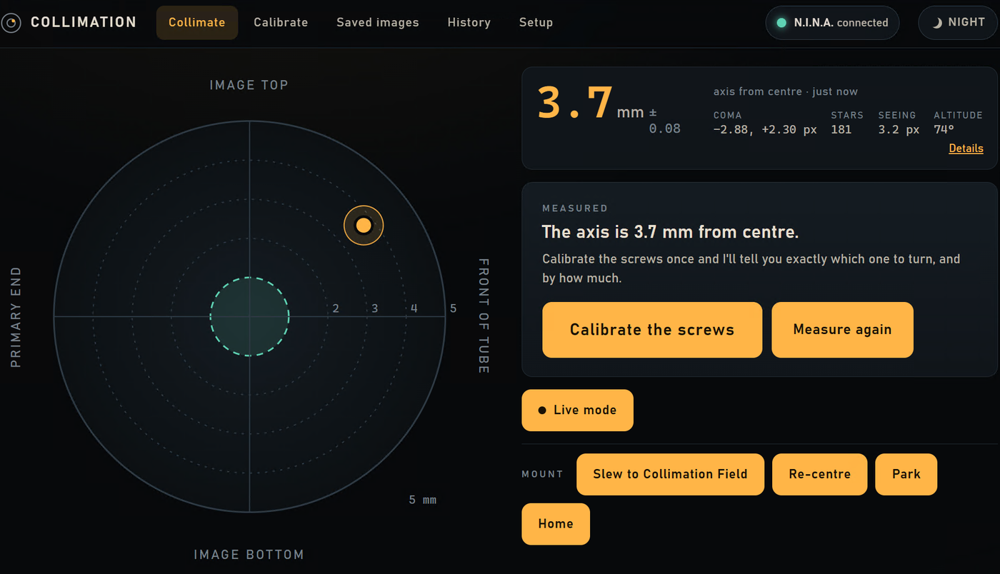
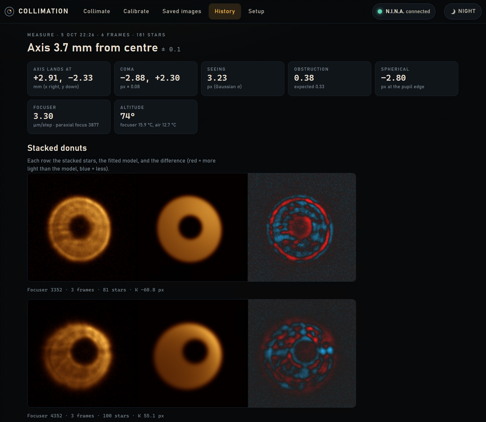
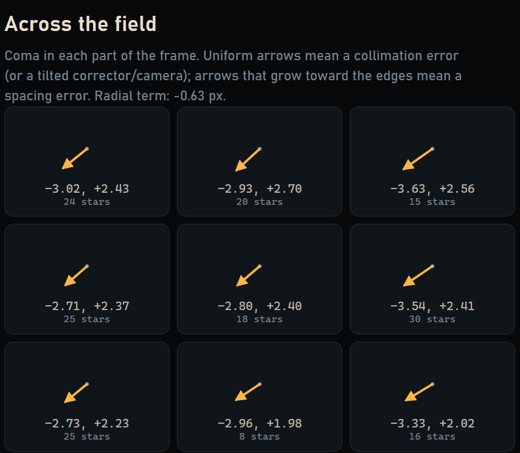
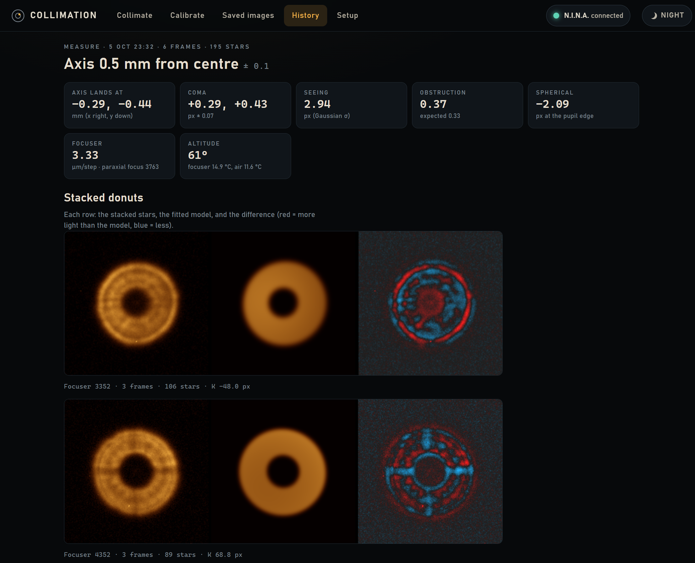
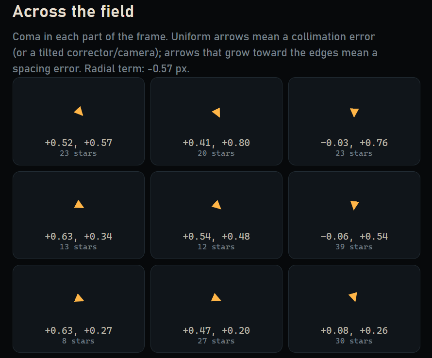

# Collimation station

Collimates an imaging Newtonian from defocused star images, with the camera left in place. It drives [N.I.N.A.](https://nighttime-imaging.eu/), measures where the primary mirror's optical axis lands on the sensor, and tells you which collimation screw to turn and by how much.

Built for a 12" f/4 Newtonian (AT12IN) with a Wynne corrector and a ZWO ASI2600MM, but the settings are general.



## Results: 5 October 2026

On its first night, the app took the primary's axis from **3.7 mm** off centre to **0.5 mm**. That's inside the 1 mm target for f/4 with a corrector over an APS-C sensor.

| | Before | After |
|---|---|---|
| Axis from centre | 3.7 mm | 0.5 mm |
| Coma (x, y) | −2.88, +2.30 px | +0.29, +0.43 px |
| Altitude | 74° | 61° |

### Before

The stacked donuts are lopsided: each one's bright edge and its shadow sit off centre. Across the field, every region shows the same coma, which means the mirror is out of alignment rather than the corrector spacing being wrong.





### After

The donuts are now symmetric. What remains across the field is small and grows toward the edges (radial term −0.57 px). That's the signature of corrector spacing, which the mirror screws can't fix.





## How it measures

1. **Defocus.** The focuser moves 500 steps inside and outside focus, and the camera takes three 5 s frames on each side.
2. **Stack.** Isolated stars are cut out, centred and averaged on each side of focus.
3. **Fit.** A ray-traced donut model is fitted to both sides together. It includes coma, astigmatism, spherical aberration, the central obstruction, uneven illumination and seeing. The fitted model and the difference are shown next to each stack, as in the images above.
4. **Locate the axis.** With a Wynne corrector, a decentred primary gives coma that's the same across the whole field. Its size and direction give where the axis lands: δ ≈ 16·N²·c / 0.95, where N is the primary's focal ratio and c is the coma radius. The axis lies opposite the direction of the coma flare.
5. **Check the field.** Coma in a 3 × 3 grid of regions separates collimation (uniform coma) from corrector spacing (coma that grows toward the edges).

### Calibrating the screws

You don't need to know which way the camera is rotated or where the screws are. The app learns what each screw does by asking you to turn A, B and C in turn, and measuring after each one.

Each turn tilts the mirror, which moves the stars as well as the coma. The star shift is measured to a pixel or two in hundreds, so it's a far more precise measure of the tilt than the coma change. A tilt θ moves the stars by 2θ·F (system focal length) and the axis by θ·f (primary focal length), so each pixel of star shift means about 1/511 px of coma the opposite way. On the first night, every screw turn agreed with that to within 10%.

Corrections are then solved with the two cheapest screws, scaled down to 70% for a soft mirror cell, and rounded to 1/16 turn. Each correction refines the calibration.

## Run it

1. Download the zip from the [latest release](https://github.com/exploded/collimation/releases/latest) and extract it to a folder, for example `C:\Collimation`. To build from source instead, run `go build` in this folder.
2. Double-click `start.bat`. It opens the station in the browser and prints the address to use from the laptop or a phone, for example `http://nina-pc:8780`.

The first time, Windows SmartScreen may say "Windows protected your PC", because the `.exe` isn't signed. Click **More info**, then **Run anyway**.

Run it on the N.I.N.A. PC so it can read the saved frames directly. Settings live in the web UI (**Setup**) and in `collimation.db` next to the `.exe`. To update, extract a newer zip over the same folder. The zip doesn't contain a database, so your settings and history are kept.

**Requirements:** N.I.N.A. with the **Advanced API** plugin (default port 1888), and the focuser, camera and mount connected in N.I.N.A.

## First night

1. **Setup:** press **Test connection**. Focus on a star, then press **Use the focuser's current position as best focus**.
2. **Collimate:** press **Slew to Collimation Field**. This slews to a field about 75° up, just west of the meridian, and plate-solves to centre it.
3. **Calibrate:** put tape labels A, B and C on the three primary collimation screws and follow the four steps.
   - Back each lock screw well off before turning. A lock that still bites swallows the turn.
   - If A and B don't move the mirror in clearly different directions, it asks for another turn of B. Only that new turn is measured.
   - When the calibration is saved, the first adjustment is waiting on **Collimate**.

## Every session

- **Step mode:** press **Measure** (about a minute). Turn the screw shown, tighten the lock, then press **Done – measure again**. Repeat until it says **Collimated** (within 1 mm). Inside 1 mm, it still offers an optional fine-tune if a turn would bring the axis at least 0.2 mm closer, about the scatter between repeat measurements.
- **Live mode:** the app loops exposures on one side of focus. Turn screws while watching the dot. It notices each adjustment from the star jump and updates after two steady frames. If the stars moved roughly the way the suggestion predicted, it says how much of the move happened and refines the calibration. Finish with a step-mode measurement.
- **Night** (top right) switches the whole UI to red.
- **N.I.N.A. light** (top right) checks every 10 seconds: green when the camera, focuser and mount are connected, amber when something is unplugged, red and blinking when N.I.N.A. can't be reached. Hover for details, or tap it to open Setup.
- **Mount** buttons under the main card: **Slew to Collimation Field**, **Re-centre**, **Park** / **Unpark** and **Home**. Park and Home ask you to confirm first.

You don't need to re-centre between adjustments. Each measurement uses every isolated star in the field. **Re-centre** is there if the field drifts a long way.

## For development

Go, server-rendered HTML with htmx, and SQLite through sqlc. The FITS reader and the least-squares fitter are written from scratch, with no dependencies.

```
go test ./...                     # unit and integration tests (integration tests need sample frames in images/)
collimation analyse -runs <dir>   # analyse frames from the command line
collimation stub-nina <dir> 1899  # fake N.I.N.A. that serves saved frames
```

`COLLIM_PORT`, `COLLIM_DB` and `COLLIM_NOBROWSER=1` override the port, database path and browser launch. After editing `internal/db/queries.sql` or `schema.sql`, run `sqlc generate`.

To publish a release, tag and push: `git tag v0.1.0 && git push --tags`. The **Release** workflow runs the tests, builds `collimation.exe` for Windows and attaches the zip to a GitHub Release.
